<table>
<tr>
<td width="250" valign="top"></td>
<td valign="middle">

<h1>현업의 병목을 발견해 실제 사용까지 연결하는</h1>

AI Product Builder입니다.

한지인 · JIIN HAN &nbsp;|&nbsp; 📧 blank.hrder@gmail.com

</td>
</tr>
</table>

 

## 목차

| | 프로젝트 | 한 줄 설명 |
|:--:|---|---|
| **1** | [**Contents Studio**](#1-contents-studio) | 같은 정보를 두 번 입력하지 않는 영화 제작 통합 웹앱 |
| **2** | [**서울시설공단 AI 실무교육**](#2-서울시설공단-ai-실무교육) | 현업의 문제를 3주 만에 작동하는 AI 시스템으로 전환 |
| **3** | [**L-Desk**](#3-l-desk) | 흩어진 교육 운영을 하나의 파이프라인으로 연결한 사내 LMS |
| **4** | [**Blanco**](#4-blanco) | 흩어진 업무 암묵지를 실행 가능한 To-do로 바꾸는 팀 업무관리 시스템 |
| **5** | [**Interactive Learning**](#5-interactive-learning) | 데이터로 문제를 확인하고 수용자별 학습 경험으로 설계 |
| **6** | [**Interactive Movie**](#6-interactive-movie) | 관객의 선택이 이야기의 결과를 바꾸는 인터랙티브 콘텐츠 |

 

---

**개인 프로젝트** &nbsp;|&nbsp; 기획 · UX 구조화 · Claude Code 기반 개발 &nbsp;|&nbsp; 2026.07 – 09 (진행 중)

# 1. Contents Studio

### <mark>같은 정보를 두 번 입력하지 않는 영화 제작 통합 웹앱</mark>

👉 **[웹앱 바로가기](https://contents-studio-rouge.vercel.app)** &nbsp;|&nbsp; 데모 계정 `blank.hrder@gmail.com` / `123456` (보기 전용 · 예시 프로젝트 「마지막 손님」)

| 문제 | 설계 |
|---|---|
| 시나리오 · 글콘티 · 스토리보드 · 샷리스트 · 일촬표에 **같은 씬·샷 정보를 반복 입력** 한 곳이 바뀌면 다른 문서를 사람이 다시 수정 | 문서를 따로 관리하지 않고, 제작 정보가 **하나의 데이터 흐름**으로 이어지도록 구조화 한 번 입력한 정보를 다른 제작 문서에서 재사용 |

**데이터 흐름**

| **Scene** | → | **Shot** | → | **Schedule** | → | **Resource** | → | **Budget** |
|:--:|:--:|:--:|:--:|:--:|:--:|:--:|:--:|:--:|
| 시나리오 · 씬 리스트 | | 글콘티 · 스토리보드 · 샷리스트 | | 일촬표 · 진행도 | | 로케이션 · 장비 · 인원 | | 예산안 · 결산안 |

**대표 설계**

| 설계 | 판단 기준을 규칙으로 |
|---|---|
| **기본값 상속** | 프로젝트 → 씬 → 샷 순으로 연출 기본값을 물려받고, 샷에서 바꾼 값만 따로 저장 |
| **촬영시간 자동 계산** | 샷 수 · 세팅 · 장비 중간 세팅 · 해체 · 난이도를 일촬표 작성 기준대로 계산하고, 우선순위에 따라 촬영순서 제안 |
| **로케이션 비용 자동 계산** | 시간당 · 인원 할증 · 최소 예약시간 규칙으로 후보 장소별 대관료 비교, 미정 금액은 0원이 아닌 상태로 구분 |
| **계획 ↔ 실제 비교** | 일촬표 계획 시간과 현장 테이크 기록을 대조해 촬영 진행도 표시 |

> **전문가의 판단을 AI가 대신하게 하기보다, 반복되는 판단 기준을 제품의 규칙으로 옮겼습니다.**

<table>
<tr>
<td width="50%">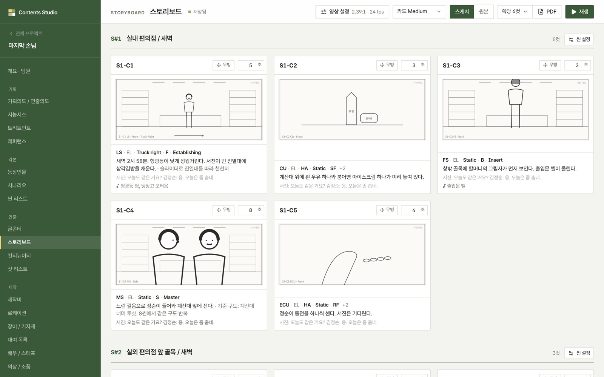 스토리보드 · 컷별 그림과 연출 요소</td>
<td width="50%">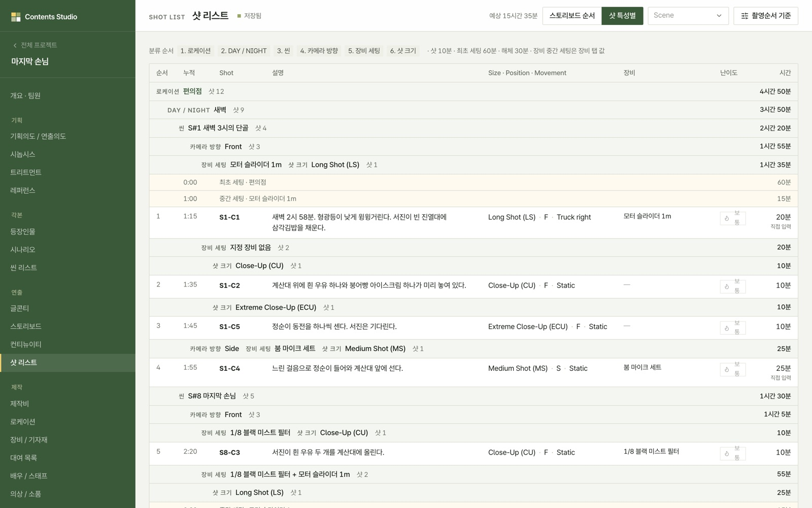 샷 리스트 · 우선순위 기준 자동 분류와 세팅·해체 시간</td>
</tr>
<tr>
<td>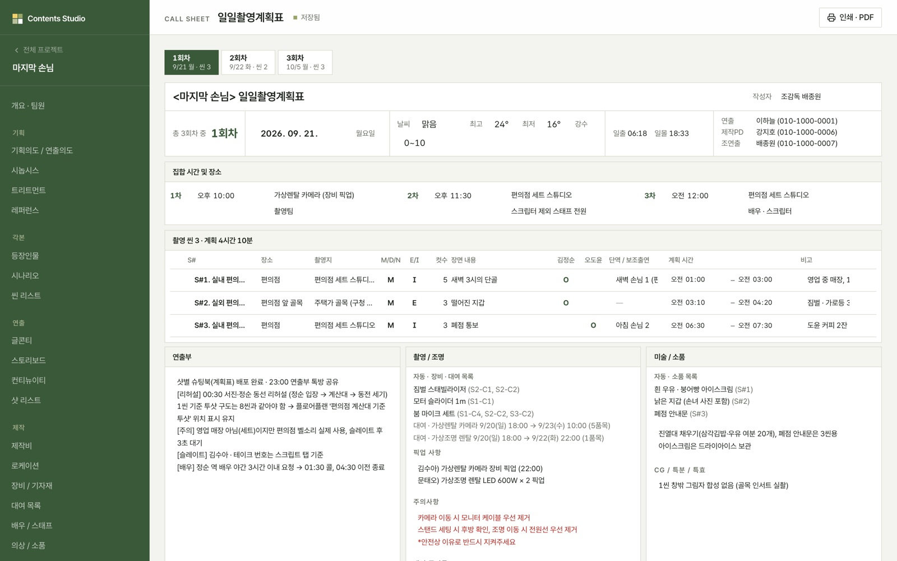 일일촬영계획표 · 다른 문서의 정보로 자동 구성</td>
<td>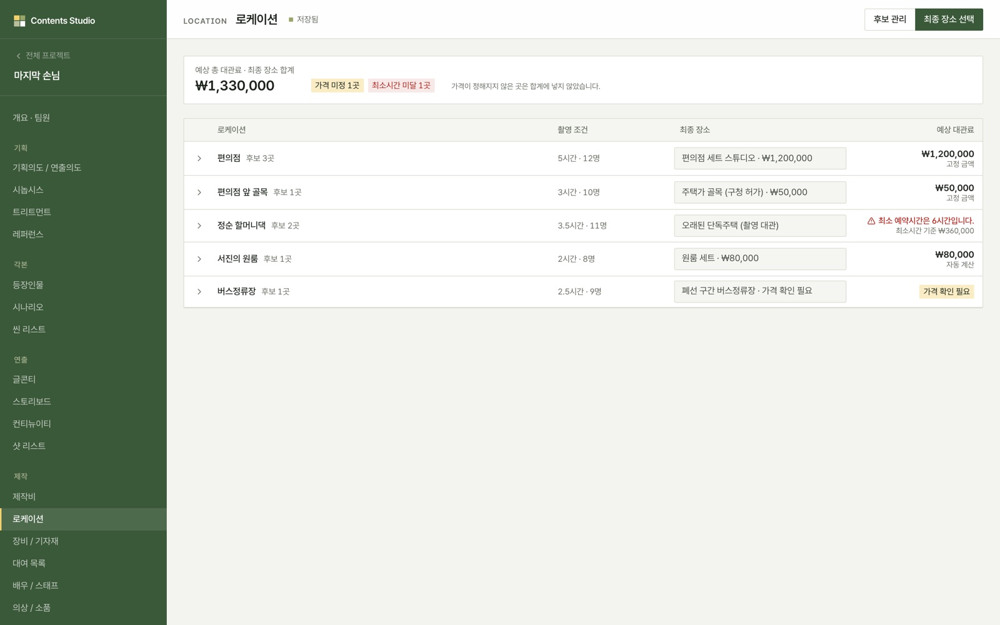 로케이션 · 후보별 대관료 자동 계산</td>
</tr>
<tr>
<td>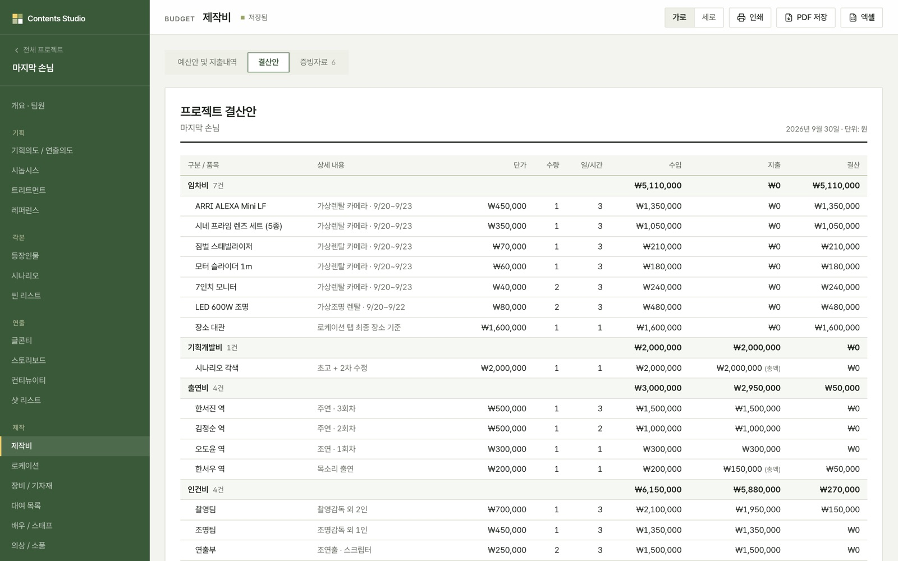 제작비 · 대여 장비 임차비 자동 반영</td>
<td>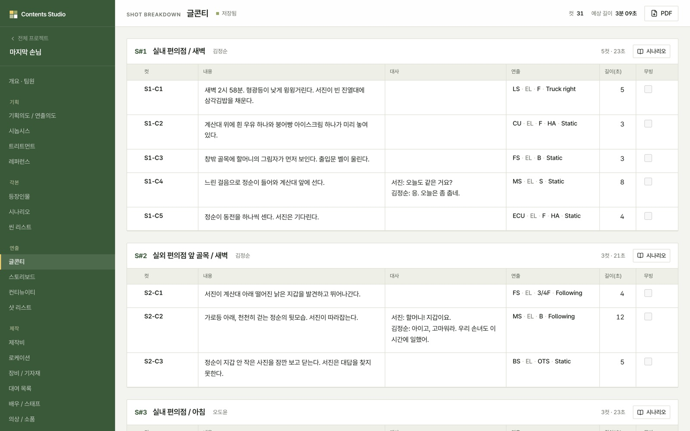 글콘티 · 시나리오를 컷으로 나누고 연출 선택</td>
</tr>
<tr>
<td>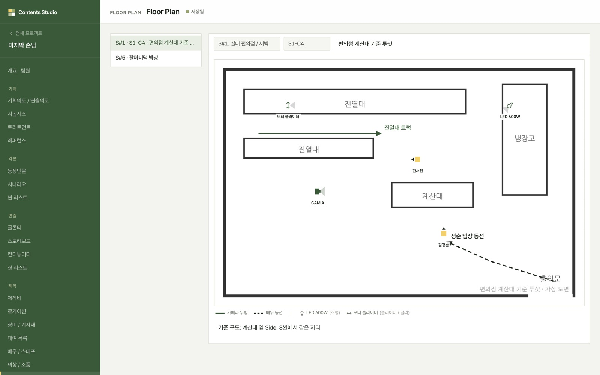 플로어플랜 · 카메라·배우·장비 배치와 동선</td>
<td>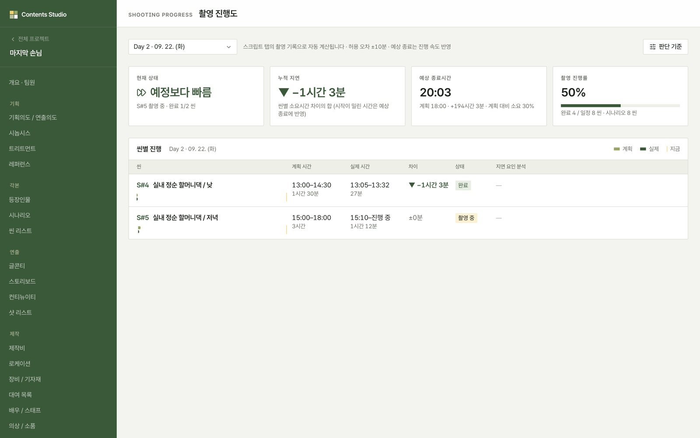 촬영 진행도 · 일촬표 계획과 현장 테이크 기록 비교</td>
</tr>
</table>

<b>개발 방식 · AI 에이전트와 일하는 규칙</b>

 

- **규칙을 문서로 먼저**: 디자인 · 입력 흐름 · 권한 · 사전 승인이 필요한 작업을 `CLAUDE.md`에 명문화해 모든 화면이 같은 기준으로 만들어지도록 설계
- **결정은 사람, 실행은 에이전트**: DB 구조 변경 · 삭제 · 권한 변경은 사전 승인 후 진행, 매 변경마다 타입 검사 · 린트 · 빌드로 검증
- **검증 루프**: 마이그레이션과 예시 데이터를 테스트 DB에서 먼저 실행한 뒤 실제 DB에 적용
- **계산 로직 분리**: 촬영순서 · 대관료 · 제작비 계산을 화면과 분리된 공통 함수로 구조화

`Next.js` `TypeScript` `Supabase` `Vercel` · `Claude Code` `VS Code`

 

---

**실무 · 발주처 서울시설공단** &nbsp;|&nbsp; 과정 기획 · 현업 과제 구조화 · 실습 운영 · 결과물 고도화 &nbsp;|&nbsp; 2026.06 – 07

# 2. 서울시설공단 AI 실무교육

### <mark>현업의 문제를 3주 만에 작동하는 AI 시스템으로 전환</mark>

| Before | After |
|---|---|
| AI 도구 사용법을 배우는 교육 | 직원이 **자기 부서의 실제 문제를 선정**하고, 3주 동안 AI 웹앱 · 자동화 시스템으로 구현하도록 설계 |

**대표 사례** — 한 번의 답변이 아니라, 여러 단계의 분석과 판단이 이어지는 Multi-step AI Workflow

<table>
<tr>
<td width="50%" valign="top">

**① 현장 위험성 평가 시스템** · 안전관리 · 🏆 수상

| 현장 사진 | → | 위험요인 분석 | → | 법령 근거 연결 | → | 위험성 평가 지원 |
|:--:|:--:|:--:|:--:|:--:|:--:|:--:|

현장 사진에서 위험요인을 식별하고, 관련 법령 근거까지 연결해 위험성 평가를 지원하는 AI 웹앱

</td>
<td width="50%" valign="top">

**② 공공자전거 수리 우선순위 시스템** · 공공자전거 운영처 · 🏆 수상

| 고장 데이터 | → | 수리 대상 선별 | → | 우선순위 판단 | → | 정비 대상 정리 |
|:--:|:--:|:--:|:--:|:--:|:--:|:--:|

고장 데이터를 기반으로 수리가 필요한 자전거를 자동 선별하고 수리 우선순위를 제안하는 업무 시스템

</td>
</tr>
</table>

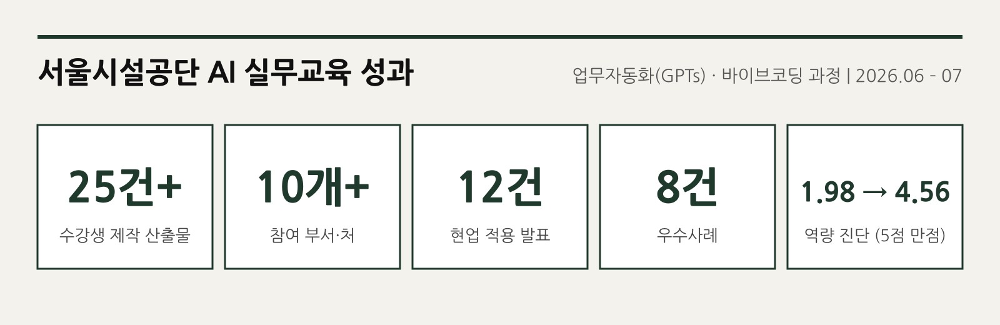

<b>과정별 결과물 전체 보기</b>

 

**업무자동화 과정 (GPTs)** — 직원 13명 · 현업 적용 12건 발표 · 우수사례 3건

| 업무 영역 | 만든 것 | 효과 |
|---|---|---|
| 민원 응대 | 민원 유형 분류 · 답변 초안 · 담당부서 라우팅 | 건당 15분 → 30초 초안 + 검토 |
| 규정 검토 | 일상감사·수료증 등 규정 대조 · 1차 점검 | 1차 점검 자동 · 판단은 사람 |
| 정산·보고 | 결과보고서 · 정산서 · 집행 내역 자동 작성 | 반나절 → 초안 1분 + 검토 |
| 계약·입찰 | 낙찰 계약대상 정리 · 공고 초안 · 감정평가 요약 | 수 시간 → 초안 수 분 |
| 수납 관리 | 미납 정보 웹 크롤링 실행파일(exe) | 100~200건 자동 수집 · 수상 |

**바이브코딩 과정 (AI 웹앱 · 실행파일)** — 10개+ 부서 · 실동작 시스템 약 10건 · 우수사례 5건

| 부서 | 만든 시스템 | 상태 |
|---|---|---|
| 기획조정실 | 주요사업 통합 관리 대시보드 (200여 개 사업, 보고 절차 대체) | 완성 · 도입 예정 |
| 안전관리 | 현장 위험성 평가 앱 (사진 분석 · 법령 근거) | 완성 · 수상 |
| 인재문화원 | 교육운영 도우미 · 자격증 지원 · 만족도 실시간 조사 | 완성 · 라이브 테스트 |
| 공공자전거 운영처 | 고장 자전거 자동 선별 · 수리 우선순위 | 완성 · 수상 |
| 공사감독처 | 착공 필수서류 안내 · 품질시험 자동 산출 | 완성 |
| 공사감독2처 | 공사현황 취합 대시보드 | 완성 · 도입 결정 |
| 인사노무처 | 휴가 매뉴얼 FAQ 앱 (150문항) | 완성 · 검수 중 |
| 총무 | 비품 신청 관리 (로컬 실행파일) | 완성 |

 

---

**실무 · 사내 시스템** &nbsp;|&nbsp; 기획 · AI 활용 개발 · 사내 적용 및 확산

# 3. L-Desk

### <mark>흩어진 교육 운영을 하나의 파이프라인으로 연결한 사내 LMS</mark>

| 문제 | 설계 |
|---|---|
| 한 과정을 운영할 때 명단 · 안내 · 출결 · 강사정보 · 교육자료 · 결과보고를 엑셀 · 메일 · 문서에서 따로 관리 **같은 정보를 단계마다 반복 입력** | 한 번 등록한 정보가 **다음 운영 단계까지 이어지도록** 운영 전 과정을 하나의 파이프라인으로 구조화 |

**운영 파이프라인** — 한 번 등록한 명단 · 출결 · 설문이 결과보고서까지 이어지는 구조

| **명단** | → | **안내** | → | **출결** | → | **산출물** | → | **설문** | → | **수료** | → | **결과보고** |
|:--:|:--:|:--:|:--:|:--:|:--:|:--:|:--:|:--:|:--:|:--:|:--:|:--:|
| 일괄 등록 | | 링크 · QR | | QR 실시간 | | 업로드 | | 자동 집계 | | 수료증 | | 자동 반영 |

| 단계 | Before | After (L-Desk) |
|---|---|---|
| **명단 · 출결** | 명단 작성 → 출석부 제작 → 수기 출결 → 스캔 · 정리 → 보고서 직접 입력 | 템플릿으로 명단 일괄 등록 → QR 출결 실시간 관리 → 결과보고서 자동 반영 |
| **학습자 안내** | 노션 페이지 제작 · 배포, 강사에게 리마인드 요청 | 공지사항 링크 · QR 하나로 안내 |
| **산출물** | 드라이브 · 협업툴 공유 링크를 만들어 수합 | 교육생이 올리면 바로 확인, 강사 피드백 등록 |
| **만족도 설문** | 구글폼 · 서면 수합 → 결과보고서에 수치 직접 입력 | 문항 설정만 하면 자동 집계 (문항 템플릿 · 7점 척도) |
| **식사 관리** | 구글폼 · 메뉴판 제작 → 주문 수량 직접 집계 | QR 주문 → 메뉴 자동 집계 |
| **수료증** | 양식에 값 직접 입력 → PDF 저장 | 시작번호 지정 · 커스텀 양식으로 발급 |
| **결과보고서** | 이전 과정과 겹치는 내용 외 모두 직접 작성 | 출결 · 만족도 자동 반영, 교육사진 불러오기, AI 요약 |

그 밖에 자료실(교육사진 보관) · 상담 관리(구직자 과정 취업상담일지)까지 한 시스템에서 운영

**결과**

<table>
<tr>
<th width="30%">1인당 월 운영 가능 과정</th>
<th width="70%">적용 · 확산</th>
</tr>
<tr>
<td align="center"><b>3개 → 5~6개</b></td>
<td>실제 교육 운영 적용 &nbsp;·&nbsp; 임직원 대상 시연 &nbsp;·&nbsp; 사내 사례공유회 발표 (2026.09)</td>
</tr>
</table>

🔒 사내 업무 시스템으로 서비스 및 소스코드는 공개하지 않습니다.

 

---

**실무 · 팀 프로젝트** &nbsp;|&nbsp; 기획 · 개발 · 팀 적용 &nbsp;|&nbsp; Lovable &nbsp;|&nbsp; 2026.02 – 05

# 4. Blanco

### <mark>업무 프로세스 · 인수인계 · 매뉴얼에 흩어진 암묵지를 실행 가능한 To-do로 바꾸는 팀 업무관리 시스템</mark>

👉 **[Blanco 바로가기](https://blancohrd.lovable.app/)** &nbsp;|&nbsp; 로그인 `blank.hrder@gmail.com` / `12345678`

<table>
<tr>
<td width="50%">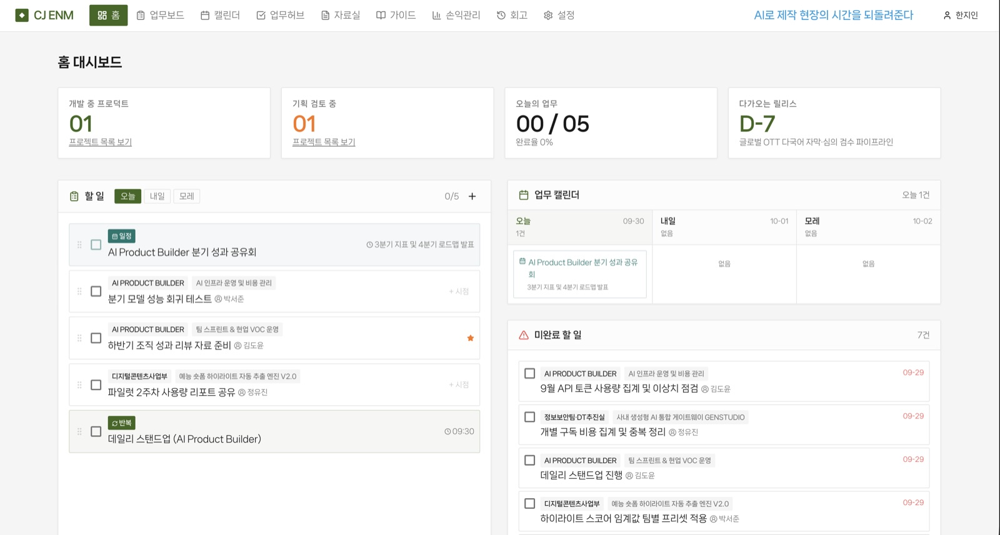 홈 대시보드 · 오늘의 할 일과 지난 마감 업무</td>
<td width="50%">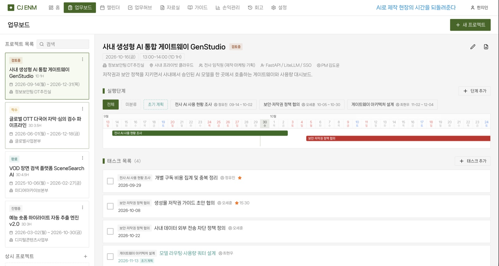 업무보드 · 실행단계와 태스크</td>
</tr>
</table>

| 문제 | 설계 |
|---|---|
| 업무 노하우와 인수인계가 문서와 개인의 기억에 흩어져, 새 프로젝트마다 담당자가 매뉴얼을 다시 읽고 할 일을 직접 정리 **업무 방법은 조직 안에 있지만 실행 가능한 형태가 아닌 상태** | 흩어진 암묵지를 **과정 유형별 템플릿으로 구조화**하고, 프로젝트 생성과 동시에 실행 가능한 To-do로 펼쳐지도록 설계 |

| 프로세스 · 매뉴얼 · 인수인계 | → | 암묵지 구조화 | → | 업무 템플릿 | → | 프로젝트 생성 | → | To-do 자동 구성 | → | 진행 관리 | → | 회고 축적 |
|:--:|:--:|:--:|:--:|:--:|:--:|:--:|:--:|:--:|:--:|:--:|:--:|:--:|

| 대표 기능 | |
|---|---|
| **업무 프로세스 템플릿화** | 과정 유형별 업무 순서와 체크포인트를 재사용 가능한 템플릿으로 저장 |
| **암묵지 → To-do 전환** | 인수인계 · 매뉴얼 내용을 실행 가능한 업무 단위로 바로 생성 |
| **지난 마감 자동 이월** | 기한이 지난 미완료 업무를 오늘의 할 일로 끌어올려 누락 방지 |
| **회고 축적** | 프로젝트 회고를 태그별로 저장해 다음 프로젝트와 후임자의 인수인계 자산으로 활용 |

| 결과 | |
|:--:|---|
| **놓치는 업무 약 90% 감소** | 교육 운영 자체는 L-Desk가, 팀의 일하는 방식은 Blanco가 맡도록 역할 분리 |

> **사람에게만 남아 있던 업무 암묵지를 팀이 반복해서 실행할 수 있는 구조로 바꿨습니다.**

 

---

**교육 과정 · 개인 프로젝트** &nbsp;|&nbsp; 데이터 분석 · 교육 기획 · 인터랙티브 콘텐츠 제작 &nbsp;|&nbsp; 2025.04 – 07

# 5. Interactive Learning

### <mark>데이터로 문제를 확인하고 수용자별 학습 경험으로 설계</mark> &nbsp;수용자 중심 피드백 문화 이러닝

| **Data** | → | **Problem Definition** | → | **Persona** | → | **Interaction** |
|:--:|:--:|:--:|:--:|:--:|:--:|:--:|
| Netflix 직원 리뷰 분석 | | 리뷰 단점(cons)에 communication이 등장하면 조직문화 평점이 통계적으로 유의하게 낮음 (t-검정) | | 같은 피드백도 받는 사람에 따라 다르게 받아들인다고 판단 → DiSC 유형별 페르소나 | | "이 사람에게 어떻게 말하시겠습니까?" 선택 → 결과 피드백 확인 |

- **대상 · 분량**: HRD팀 중간관리자(팀장) · 10분
- **과정**: 서울시 매력일자리 'HRD 에듀테크 AI 콘텐츠 기획자 과정' · 한국에듀테크산업협회
- **제작**: 요구분석부터 교육 기획 · 영상 기획 · 촬영 · 출연 · 편집까지 1인 제작

<table>
<tr>
<td>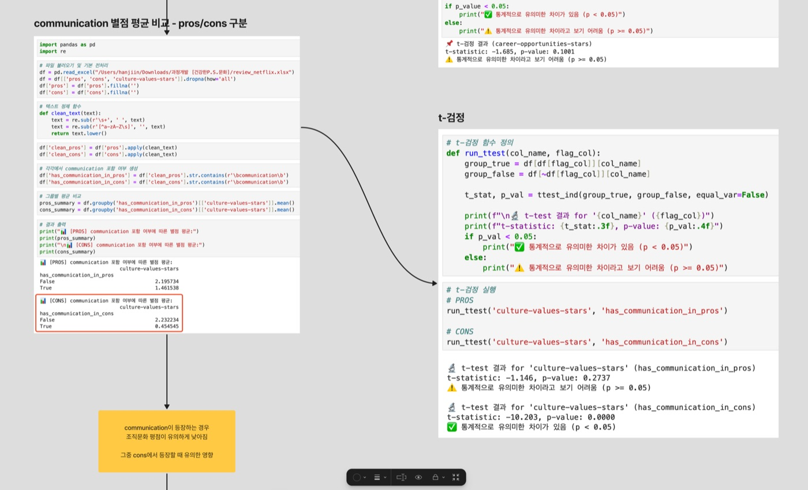 요구분석 · 리뷰 데이터 t-검정</td>
<td> 이러닝 영상</td>
</tr>
</table>

 

---

**공모전 · 팀 그린스완** &nbsp;|&nbsp; 기획 · 연출 · 인터랙션 설계 &nbsp;|&nbsp; 임팩트닷커리어 '작전명: 임팩트타운' &nbsp;|&nbsp; 2024.08 – 10

# 6. Interactive Movie

### <mark>관객의 선택이 이야기의 결과를 바꾸는 인터랙티브 콘텐츠</mark> &nbsp;기후위기 인터랙티브 무비 · 복권 긁기 프로젝트

| 선택 | → | 결과 | → | 다음 선택 |
|:--:|:--:|:--:|:--:|:--:|

기후위기 정보를 일방적으로 전달하기보다, 관객이 직접 선택하고 그 결과를 경험하도록 스토리 구조를 설계. 
관객을 시청자가 아닌 **콘텐츠의 흐름에 개입하는 사용자**로 설정.

🏆 **2024년도 미디어 S/W 및 콘텐츠 제작대회 대상**

 

---

<b>감사합니다 :)</b> blank.hrder@gmail.com

